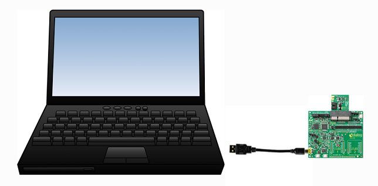
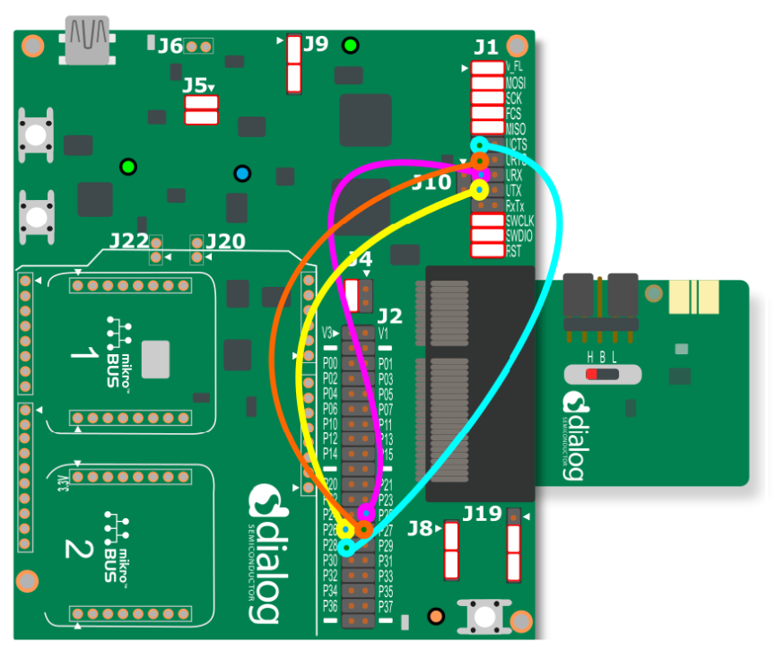

# python_gtl_thread

A python library for controlling Renesas BLE devices (DA14xxx) using the Generic Transport Layer (GTL)

For additional information on the GTL please see the [GTL User Manual](https://www.renesas.com/us/en/document/mat/um-b-143-renesas-external-processor-interface-gtl-interface?language=en&r=1564826)

## Purpose

The intent of this library is to provide a python interface similar to [SDK10](http://lpccs-docs.renesas.com/um-b-092-da1469x_software_platform_reference/User_guides/User_guides.html#the-ble-framework) for controlling BLE of DA14xxx devices. This is achieved by communicating with a development kit running GTL supported firmware over a USB port on your PC:



The primary intent is for use as a central device for benchtop testing, continuous integration, or as an end-of-line tool.

## Quickstart

1. Clone or download this repository

2. Connect the jumpers on the DA14531 Pro Development kit as depicted below:

    

3. Download the GTL enabled [firmware binary](firmware/da14531mod_pro_kit.bin) to the DA14531 Pro Development kit.

4. Open a command prompt or terminal and navigate to the repository on your PC.

5. Setup a virtual envirornment by calling: `<path_to/python_gtl_thread>$ python -m venv ./venv`. Note this library has been tested with Python v3.10.5. To create a virtual enviornment that uses Python 3.10.5, you must already have Python 3.10.5 downloaded on your computer. To use the above command to create a Python 3.10.5 enviornment, Python 3.10.5 must be configured in your PATH. You can download it from the [python website](https://www.python.org/downloads/release/python-3105/).

6. Activate the virtual enviornment. The specific command depends on your operating system. From a windows command prompt call: `<path_to_venv>\Scripts\activate.bat`

7. Call: `pip install .` to install the python_gtl_thread package and its dependencies.

8. The pacakge is now installed ang you are ready to run one of the [examples](examples)

## Quickstart (VS Code)

1. Follow steps 1-3 in the [Quickstart](#quickstart) section.

2. Open the `python_gtl_thread` repository directory in VS Code.

3. Setup a virtual envirornment by calling: `$ python -m venv ./venv` from the VS Code terminal. Note this library has been tested with Python v3.10.5. To create a virtual enviornment that uses Python 3.10.5, you must already have Python 3.10.5 downloaded on your computer. To use the above command to create a Python 3.10.5 enviornment, Python 3.10.5 must be configured in your PATH. You can download it from the [python website](https://www.python.org/downloads/release/python-3105/).

4. Activate the virtual enviornment. Hold CTRL+shift+P to open the command palette. Select `Python: Select Interpreter`. Select the interpreter in the virtual enviorment you just created (labeled venv).
Open a new terminal in VS Code and the virtual enviornment will be activated.

5. Call: `pip install .` to install the python_gtl_thread package and its dependencies.

6. The pacakge is now installed ang you are ready to run one of the [examples](examples)

## Basic Usage

### Create a BLE Central object and perform initilization

```Python
import python_gtl_thread as ble

central = ble.BleCentral("COM54")

# Initialize the Python BLE Framework
central.init()

# Start operating as a BLE Central 
central.start()

# Set the IO capabilities
central.set_io_cap(ble.GAP_IO_CAPABILITIES.GAP_IO_CAP_KEYBOARD_DISP)
```

### Initiate a BLE Operation

Some examples include:

Scanning:

```Python
central.scan_start(type=ble.GAP_SCAN_TYPE.GAP_SCAN_ACTIVE,
                   mode=ble.GAP_SCAN_MODE.GAP_SCAN_GEN_DISC_MODE,
                   interval=160,
                   window=80,
                   filt_wlist=False,
                   filt_dupl=True)
```

Connecting:

```Python
peripheral_addr = ble.BleUtils.str_to_bd_addr("48:23:35:00:1b:53,P") 
connection_params = ble.GapConnParams(interval_min_ms=50, interval_max_ms=70, slave_latency=0, sup_timeout_ms=420)
central.connect(peripheral_addr, connection_params)
```

Read a characteristic value

```Python
central.read(conn_idx=0, handle=24, offset=0) 
```

Write a characteristic value

```Python
central.write(conn_idx=0, handle=24, offset=0, value=1234) 
```

Disconnect

```Python
central.disconnect(conn_idx=0) 
```

### Handle asynchronus events

The framework returns asynchronous events to the application through an event queue. Calling `BleCentral.get_event()` will get an event from the queue. All of the events returned by `BleCentral.get_event()` are a subclass of `BleEventBase`.
A variety of different events occur throughout the life a BLE application. Some example events include `BleEventGapConnectionCompleted`, `BleEventGapDisconnected`, `BleEventGattcReadCompleted`, `BleEventGattcWriteCompleted`.
Each event has an `evt_code` to identify the type of event.  

For example, after you initiate a write you will receive a `BleEventGattcWriteCompleted` event which has an `evt_code` of `BLE_EVT_GATTC.BLE_EVT_GATTC_WRITE_COMPLETED`. Your application can
handle the event however it sees fit. If your application does not handle the event, call the `BleCentral.handle_event_default()` to have the BLE framework process the event for you.

```Python
# This call will block until an event is available
evt = central.get_event()
    
    # Determine which event occurred. It will be of type BLE_EVT_GAP, BLE_EVT_GATTC, or BLE_EVT_GATTS
    match evt.evt_code:

        # Handle the event
        case ble.BLE_EVT_GAP.BLE_EVT_GAP_ADV_REPORT:
            handle_evt_gap_adv_report(evt)
        case ble.BLE_EVT_GAP.BLE_EVT_GAP_SCAN_COMPLETED:
            handle_evt_gap_scan_completed(evt)
        case ble.BLE_EVT_GAP.BLE_EVT_GAP_CONNECTED:
            handle_evt_gap_connected(evt)
        case ble.BLE_EVT_GAP.BLE_EVT_GAP_CONNECTION_COMPLETED:
            handle_evt_gap_connection_compelted(evt)
        case ble.BLE_EVT_GAP.BLE_EVT_GAP_DISCONNECTED:
            handle_evt_gap_disconnected(evt)
        case ble.BLE_EVT_GATTC.BLE_EVT_GATTC_BROWSE_SVC:
            handle_evt_gattc_browse_svc(evt)
        case ble.BLE_EVT_GATTC.BLE_EVT_GATTC_BROWSE_COMPLETED:
            handle_evt_gattc_browse_completed(evt)
        case ble.BLE_EVT_GATTC.BLE_EVT_GATTC_NOTIFICATION:
            handle_evt_gattc_notification(evt)
        case ble.BLE_EVT_GATTC.BLE_EVT_GATTC_WRITE_COMPLETED:
            handle_evt_gattc_write_completed(evt)
        case ble.BLE_EVT_GATTC.BLE_EVT_GATTC_READ_COMPLETED:
            handle_evt_gattc_read_completed(evt)

        case _:
            # For any events not handled by your application, call the BleCentral default handler to process the event
            central.handle_event_default(evt)
```

## Architecture

Refer to the [architecture](docs/architecture.md) desciption.
