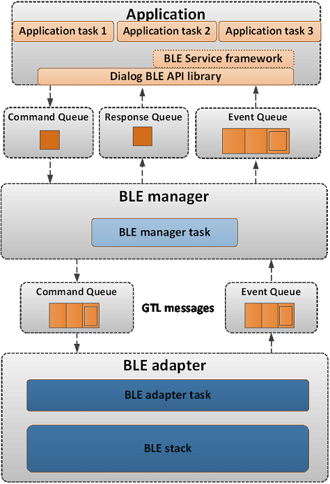
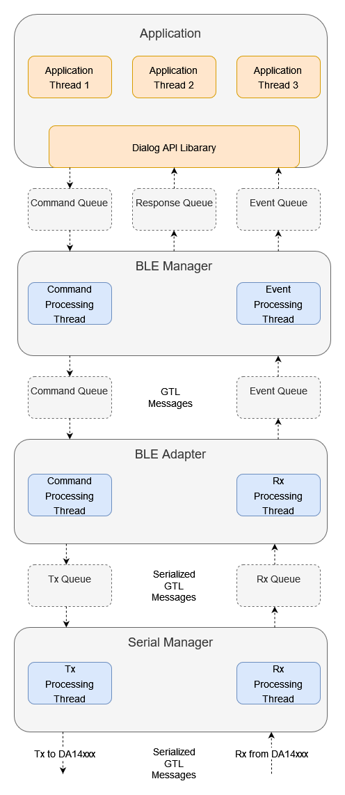

# python_gtl

A python library for controlling Renesas BLE devices (DA14xxx) using the Generic Transport Layer (GTL)

For additional information on the GTL please see the [GTL User Manual](https://www.renesas.com/us/en/document/mat/um-b-143-renesas-external-processor-interface-gtl-interface?language=en&r=1564826)

## Purpose

The intent of this library is to provide a python interface similar to [SDK10](http://lpccs-docs.renesas.com/um-b-092-da1469x_software_platform_reference/User_guides/User_guides.html#the-ble-framework) for controlling BLE of DA14xxx devices. This is achieved by communicating with a development kit running GTL supported firmware over a USB port on your PC.


The primary intent is for use as a central device for benchtop testing, continuous integration, or as an end-of-line tool.

## Framework Overview

The BLE Framework implemented in SDK10 is depecited below:



In SDK10, FreeRTOS is used as an operating system. FreeRTOS provides prioritized scheduling of tasks as well as primitives for communication between tasks such as queues, mutexes, semaphores, etc.

This library provides a python implementation for several layers of the SDK10 BLE Framework (BLE Service Framework, Dialog BLE API Library, BLE Manager, and BLE Adapter) in order to control DA14xxx devices from a python enviornment running on your PC. The python [asyncio](https://docs.python.org/3/library/asyncio.html) library is used to achieve concurrency between tasks.

The architecture implemented in python is depecited below:



It is largely similar to the original SDK10 architecture, with the addition of the `Serial Manager` layer, whose responsibility it is to communicate serialized GTL messages with the development kit over the serial port.

## Getting Started

To use the library, the DA14xxx device must be running firmware that supports GTL commands. 

For DA14585/DA14531 devices, SDK6 includes projects which support GTL commands. Specifically the  `empty_template_ext` project, located in `projects\target_apps\template\empty_template_ext`, is a good starting point for a GTL based application.

In addition the `prox_reporter_ext` and `prox_monitor_ext` projects, located in the `projects\target_apps\ble_examples\prox_reporter_ext` and
`projects\target_apps\ble_examples\prox_monitor_ext` folders respectively, are available.

To communicate with a DA145xx running GTL supported firmware from python, you must setup your development kit as described in [here](http://lpccs-docs.renesas.com/UM-140-DA145x-CodeLess/howToUse.html#hardware-setup). Please note, you may need to modify the UART pin definitions defined in `user_periph_setup.h` of the firmware project you use (e.g. `empty_template_ext`) depending on which daughterboard you are using.

Once you have programmed the development kit with GTL supported firmware, you are ready to communicate with it from python.

The [central_at_command](example/central_at_command/central_at_command_cli.py) is the most developed example. It provides a AT Command like interface to control a BLE central deivce. 

## High Level Directory Overview

The [ble_devices](ble_devices) directory contains the primary classes enabling a user to interact with the python BLE framework, namely the `BleCentral` and `BlePeripheral` classes. These classes provide methods for achieving most of the functionality required by a BLE application.

For example, the `BleCentral` class implement methods for scanning, connecting, browsing, discovering, reading, writing, etc. These methods are typically wrappers for various methods implemented in the `ble_api`.

The [services](services)

The [ble_api](ble_api) directory contains classes that implement the functionality of the `Dialog BLE API Library`. For example, `BleGap.py` implements functionality of the `ble_gap.c` API.

The [manager](manager) directory contains classes that implement the functionality of the `BLE Manager`.

The [adapter](adapter) directory contains classes that implement the functionality of the `BLE Adapater`

The [serial_manager](serial_manager) directory contains the `SerialStreamManager` class. It is responsible for transmitting serialized GTL messages from the BLE Adapter over the serial port. In addition, it receives serialized GTL messages over the serial port (from the development kit) and provides them to the `BleAdapter` for consumption.

The [gtl_messages](gtl_messages) directory contains various GTL messages defined in the [GTL User Manual](https://www.renesas.com/us/en/document/mat/um-b-143-renesas-external-processor-interface-gtl-interface?language=en&r=1564826)  

A generic base class for every message is defined in [gtl_messages/gtl_message_base.py](gtl_messages/gtl_message_base.py):

```python
class GtlMessageBase():

    def __init__(self, 
                 msg_id: GAPM_MSG_ID = GAPM_MSG_ID.GAPM_UNKNOWN_TASK_MSG, 
                 dst_id: KE_API_ID = KE_API_ID.TASK_ID_INVALID,
                 src_id: KE_API_ID = KE_API_ID.TASK_ID_INVALID,
                 par_len: int = 0, 
                 parameters: object() = None ):

        self.msg_id = msg_id
        self.dst_id = dst_id
        self.src_id = src_id
        self.par_len = par_len
        self.parameters = parameters
```

This message definition is consistent with the the GTL message format from the user manual:


Separate python files exist for messages related to different BLE Layers. For example, the [gtl_messages/gtl_message_gapm.py](gtl_messages/gtl_message_gapm.py) is a port of GAP Manager related GTL messages. 

Each message takes care of setting the appropriate MSG_ID, DST_ID, SRC_ID, and PAR_LEN for its specific message type. A user only needs to provide the appropriate `parameters` to create a valid message. The `parameters` are one of the `LittleEndianStructure`'s defind in [gtl_port](gtl_port). For example, below demonstrates creating a `GAPM_RESET_CMD`:

```python
reset_cmd = GapmResetCmd(parameters = gapm_reset_cmd(GAPM_OPERATION.GAPM_RESET))
```

If no `parameters` are specified when the message is created, default `parameters` will be created. The parameters can then be modified after construction as demonstrated in teh  `GAPM_SET_DEV_CONFIG_CMD` below:

```python 
set_dev_cmd = GapmSetDevConfigCmd()
set_dev_cmd.parameters.operation = GAPM_OPERATION.GAPM_SET_DEV_CONFIG
set_dev_cmd.parameters.role = GAP_ROLE.GAP_ROLE_PERIPHERAL
set_dev_cmd.parameters.att_cfg = 0x20 
set_dev_cmd.parameters.max_mtu = 512 
set_dev_cmd.parameters.max_txoctets = 251
set_dev_cmd.parameters.max_txtime = 2120
```

The [gtl_port](gtl_port) directory is a port of files with GTL structure and enum definitions from their corresponding .h files. Each .h file has a corresponding .py file:

* co_bt.h -> co_bt.py
* co_version.h -> co_version.py
* gap.h -> gap.py
* gapm_task.h -> gapm_task.py
* rwble_hl_error.h -> rwble_hl_error.py
* rwip_config.h -> rwip_config.py
* etc.

The C enums defined in these .h files are defined as Python IntEnums in the corresponding .py file.

For example, the c enum `gapm_addr_type` defined in `gapm_task.h`:

```c
/// Device Address type Configuration
enum gapm_addr_type
{
    /// Device Address is a Public Address
    GAPM_CFG_ADDR_PUBLIC,
    /// Device Address is a Random Static address
    GAPM_CFG_ADDR_PRIVATE,
    GAPM_CFG_ADDR_STATIC = GAPM_CFG_ADDR_PRIVATE,
    /// Device Address generated using Privacy feature in Host
    GAPM_CFG_ADDR_PRIVACY,
    /// Device Address generated using Privacy feature in Controller
    GAPM_CFG_ADDR_PRIVACY_CNTL = 0x4,
};
```

is now `GAPM_ADDR_TYPE` defined in `gapm_task.py`:

```python
# Device Address type Configuration
class GAPM_ADDR_TYPE(IntEnum):

    # Device Address is a Public Address
    GAPM_CFG_ADDR_PUBLIC = 0
    # Device Address is a Random Static address
    GAPM_CFG_ADDR_PRIVATE = auto()
    GAPM_CFG_ADDR_STATIC = GAPM_CFG_ADDR_PRIVATE
    # Device Address generated using Privacy feature in Host
    GAPM_CFG_ADDR_PRIVACY = auto()
    # Device Address generated using Privacy feature in Controller
    GAPM_CFG_ADDR_PRIVACY_CNTL = 0x4
```

The C structures defined in these files are ported to python classes. Each of these classes inherits from the Python [ctypes](https://docs.python.org/3/library/ctypes.html) library [LittleEndianStructure](https://docs.python.org/3/library/ctypes.html#ctypes.LittleEndianStructure) class. The python ctypes library is used to simplify converting these data types into the appropriate byte sequence for transmission over the serial port.

For example, the c structure `struct gapm_operation_cmd` in `gapm_task.h`:

```c
/// Operation command structure in order to keep requested operation.
struct gapm_operation_cmd
{
    /// GAP request type
    uint8_t operation;
};
```

is now  `class gapm_operation_cmd(LittleEndianStructure)` in `gapm_task.h`:

```python
# Operation command structure in order to keep requested operation.
class gapm_operation_cmd(LittleEndianStructure):
    def __init__(self, operation: GAPM_OPERATION = GAPM_OPERATION.GAPM_NO_OP):
        self.operation = operation
        super().__init__(operation=self.operation)

                 # GAP request type
    _fields_ = [("operation", c_uint8)]
```

Note a constructor has been added to the class definition, though this is not required by the ctypes library. This is added for two reasons

1. To aid in [type hinting](https://docs.python.org/3/library/typing.html)

    It is difficult to know from the type of each Structure field alone what values are appropriate for the field, as the fields are often generic types such as uint8_t, uint16_t, etc. Using a constructor allows us to utilize type hinting to aid a developer in passing in appropriate arguments when creating these strucutres. For example when creating a `gapm_operation_cmd` the `operation` field, which is defined as a `c_uint8`, is hinted as a `GAPM_OPERATION` enum:

    

2. Using this constructor allows us to define default arguments for each Structure. This allows a developer to either create a Structure with the appropriate parameters on construction, or create the Structure and update the fields later.

    For example:

    ```python
    example_1 = gapm_operation_cmd(GAPM_OPERATION.GAPM_RESET)

    example_2 = gapm_operation_cmd()
    example_2.operation = GAPM_OPERATION.GAPM_RESET
    ```

The [tests](tests) directory contains unit tests for the messages defined in [gtl_messages](gtl_messages). For each message, an test_message is created based on an example provided in the [GTL User Manual](https://www.renesas.com/us/en/document/mat/um-b-143-renesas-external-processor-interface-gtl-interface?language=en&r=1564826).


## Architecture

TODO In depth architecture discussion