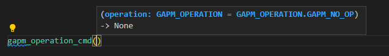
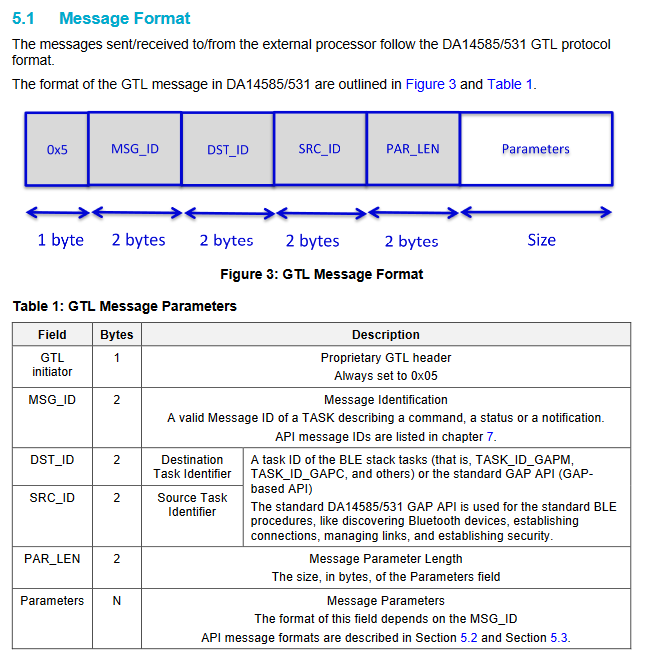

# python_gtl

A python library for communicating with Renesas BLE devices (DA14xxx) using the Generic Transport Layer (GTL)

For additional information on the GTL please see the [GTL User Manual](https://www.renesas.com/us/en/document/mat/um-b-143-renesas-external-processor-interface-gtl-interface?language=en&r=1564826)

The [gtl_messages/gtl_port](gtl_messages/gtl_port/) directory is a work in progress porting of files with GTL structure and enum definitions from their corresponding .h files to Python. Each .h file has a corresponding .py file:

* co_bt.h -> co_bt.py
* co_version.h -> co_version.py
* gap.h -> gap.py
* gapm_task.h -> gapm_task.py
* rwble_hl_error.h -> rwble_hl_error.py
* rwip_config.h -> rwip_config.py
* etc.

The C enums defined in these .h files are defined as Python IntEnums in the corresponding .py file.

For example, the c enum `gapm_addr_type` defined in `gapm_task.h`:

```c
/// Device Address type Configuration
enum gapm_addr_type
{
    /// Device Address is a Public Address
    GAPM_CFG_ADDR_PUBLIC,
    /// Device Address is a Random Static address
    GAPM_CFG_ADDR_PRIVATE,
    GAPM_CFG_ADDR_STATIC = GAPM_CFG_ADDR_PRIVATE,
    /// Device Address generated using Privacy feature in Host
    GAPM_CFG_ADDR_PRIVACY,
    /// Device Address generated using Privacy feature in Controller
    GAPM_CFG_ADDR_PRIVACY_CNTL = 0x4,
};
```

is now `GAPM_ADDR_TYPE` defined in `gapm_task.py`:

```python
# Device Address type Configuration
class GAPM_ADDR_TYPE(IntEnum):

    # Device Address is a Public Address
    GAPM_CFG_ADDR_PUBLIC = 0
    # Device Address is a Random Static address
    GAPM_CFG_ADDR_PRIVATE = auto()
    GAPM_CFG_ADDR_STATIC = GAPM_CFG_ADDR_PRIVATE
    # Device Address generated using Privacy feature in Host
    GAPM_CFG_ADDR_PRIVACY = auto()
    # Device Address generated using Privacy feature in Controller
    GAPM_CFG_ADDR_PRIVACY_CNTL = 0x4
```

The C structures defined in these files are ported to python classes. Each of these classes inherits from the Python [ctypes](https://docs.python.org/3/library/ctypes.html) library [LittleEndianStructure](https://docs.python.org/3/library/ctypes.html#ctypes.LittleEndianStructure) class. The python ctypes library is used to simplify converting these data types into the appropriate byte sequence for transmission over the serial port.

For example, the c structure `struct gapm_operation_cmd` in `gapm_task.h`:

```c
/// Operation command structure in order to keep requested operation.
struct gapm_operation_cmd
{
    /// GAP request type
    uint8_t operation;
};
```

is now  `class gapm_operation_cmd(Structure)` in `gapm_task.h`:

```python
# Operation command structure in order to keep requested operation.
class gapm_operation_cmd(Structure):
    def __init__(self, operation: GAPM_OPERATION = GAPM_OPERATION.GAPM_NO_OP):
        self.operation = operation
        super().__init__(operation=self.operation)

                 # GAP request type
    _fields_ = [("operation", c_uint8)]
```

Note a constructor has been added to the class definition, though this is not required by the ctypes library. This is added for two reasons

1. To aid in [type hinting](https://docs.python.org/3/library/typing.html)

    It is difficult to know from the type of each Structure field alone what values are appropriate for the field, as the field types are often generic types such as uint8_t, uint16_t, etc. Using a constructor allows us to utilize type hinting to aid a developer in passing in appropriate arguments when creating these strucutres. For example when creating a `gapm_operation_cmd` the `operation` field, which is defined as a `c_uint8`, is hinted as a `GAPM_OPERATION` enum:

    

2. Using this constructor allows us to define default arguments for each Structure. This allows a developer to either create a Structure with the appropriate parameters on construction, or create the Structure and update the fields later.

    For example:

    ```python
    example_1 = gapm_operation_cmd(GAPM_OPERATION.GAPM_RESET)

    example_2 = gapm_operation_cmd()
    example_2.operation = GAPM_OPERATION.GAPM_RESET
    ```

The [gtl_messages](gtl_messages) directory is a work in progress creating the various GTL messages defined in the user manual.  

A generic base class for messages is defined in [gtl_messages/gtl_message_base.py](gtl_messages/gtl_message_base.py):

```python
class GtlMessageBase():

    def __init__(self, 
                 msg_id: GAPM_MSG_ID = GAPM_MSG_ID.GAPM_UNKNOWN_TASK_MSG, 
                 dst_id: KE_API_ID = KE_API_ID.TASK_ID_INVALID,
                 src_id: KE_API_ID = KE_API_ID.TASK_ID_INVALID,
                 par_len: int = 0, 
                 parameters: object() = None ):

        self.msg_id = msg_id
        self.dst_id = dst_id
        self.src_id = src_id
        self.par_len = par_len
        self.parameters = parameters
```

This message definition is consistent with the the GTL message format from the user manual:



For example example, the [gtl_messages/gtl_message_gapm.py](gtl_messages/gtl_message_gapm.py) is a work in progress porting of GAP Manager related GTL messages. Each message takes care of setting the appropriate MSG_ID, DST_ID, SRC_ID, and PAR_LEN for its specific message type. A user only needs to provide the appropriate `parameters` to create a valid message. The `parameters` are one of the `LittleEndianStructure`'s defind in [gtl_port](gtl_port). For example, below demonstrates creating a `GAPM_RESET_CMD`:

```python
reset_cmd = GapmResetCmd(parameters = gapm_reset_cmd(GAPM_OPERATION.GAPM_RESET))
```

If no `parameters` are specified when the message is created, default `parameters` will be created. The parameters can then be modified after construction as demonstrated in teh  `GAPM_SET_DEV_CONFIG_CMD` below:

```python 
set_dev_cmd = GapmSetDevConfigCmd()
set_dev_cmd.parameters.operation = GAPM_OPERATION.GAPM_SET_DEV_CONFIG
set_dev_cmd.parameters.role = GAP_ROLE.GAP_ROLE_PERIPHERAL
set_dev_cmd.parameters.att_cfg = 0x20 
set_dev_cmd.parameters.max_mtu = 512 
set_dev_cmd.parameters.max_txoctets = 251
set_dev_cmd.parameters.max_txtime = 2120
```

The [tests](tests) directory contains unit tests for the messages defined in [gtl_message](gtl_messages). For each message, an test_message is created based on an example provided in the [GTL User Manual](https://www.renesas.com/us/en/document/mat/um-b-143-renesas-external-processor-interface-gtl-interface?language=en&r=1564826).

The [adapter](adapter)
The [manager](manager)
The [services](services)
The [ble_api](ble_api)
The [tests](adapter)

Necessary HW setup: [link](http://lpccs-docs.renesas.com/UM-140-DA145x-CodeLess/howToUse.html#hardware-setup)