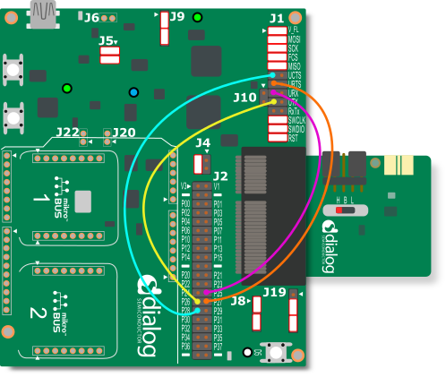

# python_gtl_thread

A python library for controlling Renesas BLE devices (DA14xxx) using the Generic Transport Layer (GTL)

For additional information on the GTL please see the [GTL User Manual](https://www.renesas.com/us/en/document/mat/um-b-143-renesas-external-processor-interface-gtl-interface?language=en&r=1564826)

## Purpose

The intent of this library is to provide a python interface similar to [SDK10](http://lpccs-docs.renesas.com/um-b-092-da1469x_software_platform_reference/User_guides/User_guides.html#the-ble-framework) for controlling BLE of DA14xxx devices. This is achieved by communicating with a development kit running GTL supported firmware over a USB port on your PC:

The primary intent is for use as a central device for benchtop testing, continuous integration, or as an end-of-line tool.

## Quickstart

1. Clone or download this repository

2. Connect the jumpers on the DA14531 Pro Development kit as depicted below:

3. Download the GTL enabled [firmware binary](firmware/da14531mod_pro_kit.bin) to the DA14531 Pro Development kit.

4. Open a command prompt or terminal and navigate to the repository on your PC.

5. Setup a virtual envirornment by calling: `<path_to/python_gtl_thread>$ python -m venv ./venv`. Note this library has been tested with Python v3.10.5. To create a virtual enviornment that uses Python 3.10.5, you must already have Python 3.10.5 downloaded on your computer. To use the above command to create a Python 3.10.5 enviornment, Python 3.10.5 must be configured in your PATH. You can download it from the [python website](https://www.python.org/downloads/release/python-3105/).

6. Activate the virtual enviornment. The specific command depends on your operating system. From a windows command prompt call: `<path_to_venv>\Scripts\activate.bat`

7. Call: `pip install .` to install the python_gtl_thread package and its dependencies.

8. The pacakge is now installed ang you are ready to run one of the [examples](examples)

## Quickstart (VS Code)

1. Follow steps 1-3 in the [Quickstart](#quickstart) section.

2. Open the `python_gtl_thread` repository directory in VS Code.

3. Setup a virtual envirornment by calling: `$ python -m venv ./venv` from the VS Code terminal. Note this library has been tested with Python v3.10.5. To create a virtual enviornment that uses Python 3.10.5, you must already have Python 3.10.5 downloaded on your computer. To use the above command to create a Python 3.10.5 enviornment, Python 3.10.5 must be configured in your PATH. You can download it from the [python website](https://www.python.org/downloads/release/python-3105/).

4. Activate the virtual enviornment. Hold CTRL+shift+P to open the command palette. Select `Python: Select Interpreter`. Select the interpreter in the virtual enviorment you just created (labeled venv).
Open a new terminal in VS Code and the virtual enviornment will be activated.

5. Call: `pip install .` to install the python_gtl_thread package and its dependencies.

6. The pacakge is now installed ang you are ready to run one of the [examples](examples)

## Architecture

Refer to the [architecture](docs/architecture.md) desciption.