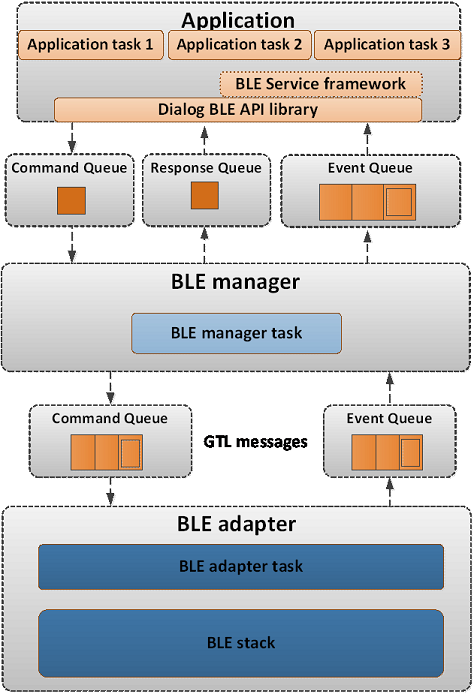
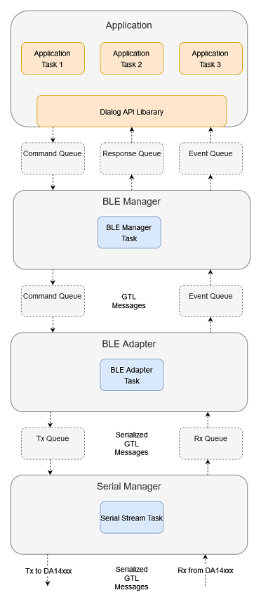
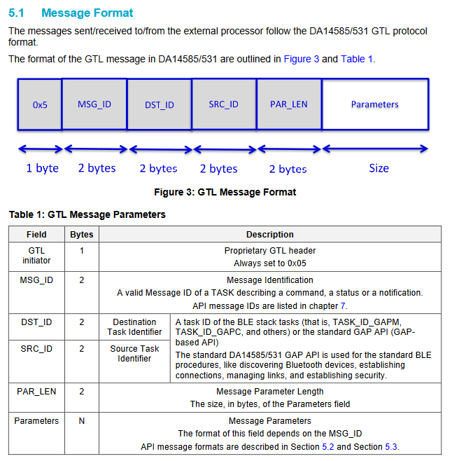
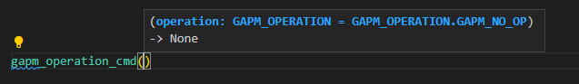

# Architecture

## Framework Overview

The intent of this library is to provide a python interface similar to [SDK10](http://lpccs-docs.renesas.com/um-b-092-da1469x_software_platform_reference/User_guides/User_guides.html#the-ble-framework) for controlling BLE of DA14xxx devices. 

The BLE Framework implemented in SDK10 is depecited below:



In SDK10, FreeRTOS is used as an operating system. FreeRTOS provides prioritized scheduling of tasks as well as primitives for communication between tasks such as queues, mutexes, semaphores, etc.

This library provides a python implementation for several layers of the SDK10 BLE Framework (e.g. the BLE Service Framework, Dialog BLE API Library, BLE Manager, and BLE Adapter). The python [threading](https://docs.python.org/3/library/threading.html) library is used to achieve concurrency between tasks as well as provide communication primitives such as the `Lock` and `Event` objects. The python [queue](https://docs.python.org/3/library/queue.html) library provides thread safe queues.

The architecture implemented in python is depecited below:



The implementation closely parallels the SDK10 architecture, with the addition of the `Serial Manager` layer, whose responsibility it is to communicate serialized GTL messages with the development kit over the serial port.

## Components

### ble_devices

The [ble_devices]( #ble_devices) directory contains the primary classes enabling a user to interact with the python BLE framework, namely the `BleCentral` and `BlePeripheral` classes. These classes provide methods to exercise BLE functionality for a central or peripheral application respectively.

For example, the `BleCentral` class implements methods for scanning, connecting, browsing, pairing, reading, writing, etc.

`BleCentral` and `BlePeripheral` both inherit from the `BleDeviceBase` class, which implements functionality common to both central and peripheral devices.

The method signatures of these classes are anagolous to their SDK10 counterparts. For example, the scan start function in SDK10 is defined as:

```
ble_error_t ble_gap_scan_start(gap_scan_type_t type, gap_scan_mode_t mode, uint16_t interval,
                           uint16_t window, bool filt_wlist, bool filt_dupl)
```

The scan start function in python is defined as:
```
    def scan_start(self,
                   type: GAP_SCAN_TYPE = GAP_SCAN_TYPE.GAP_SCAN_ACTIVE,
                   mode: GAP_SCAN_MODE = GAP_SCAN_MODE.GAP_SCAN_GEN_DISC_MODE,
                   interval: int = 0,
                   window: int = 0,
                   filt_wlist: bool = False,
                   filt_dupl: bool = False
                   ) -> BLE_ERROR:
```

The methods exposed by these classes are wrappers for class methods defined in the [ble_api](#ble_api). The intent is to provide a single object that encapsulates all the functionality for implementing a BLE central (or peripheral) device.  

### ble_api

The [ble_api](#ble_api) directory contains classes that implement the functionality of the `Dialog BLE API Library` layer. As with SDK10, functionality is broken in into logical groupings:

The `BleGapApi` class implements GAP related functionality. The `BleGattcApi` class implements GATT client related functionality. The `BleGattsApi` class implements GATT service related functionality.  

In addition, a number of classes and enums are defined for passing parameters / receiving responses and events back from the BLE Framework. Some example include `BLE_ERROR`, `BdAddress`, `GapScanParams`, `GAP_SCAN_TYPE`,  various BLE event defintions (`BleEventGapAdvCompleted`, `BleEventGapConnected`, etc.). Again, these classes and enums are anaglous to their SDK10 counterparts.  

### manager

The [manager](#manager) directory contains classes that implement the functionality of the `BLE Manager` layer.

The `BLE Manager` layer is concerned with:

- Processing commands from the [ble_api](#ble_api) and converting them to GTL messages that are passed to the [BleAdapter](#adapter).
- Prococessing events (in the form of GTL messages) from the [BleAdapter](#adapter) and converting them into events understood by the [ble_api](#ble_api).

Functionality of the `BLE Manager` layer is broken into 5 main classes:

The `BleManager` class orchestrates command and event processing. When the `BleManager` is initialized, two daemon threads are created. One to receive and process commands from the [ble_api](#ble_api), and a second to receive and process events from the [BleAdapter](#adapter). When a command or event is received, the `BleManager` forwards it to the appropriate handler implemented in one of the processing classes: `BleManagerGap`, `BleManagerGattc`, `BleManagerGatts`, or `BleManagerCommon`

The `BleManagerGap` class processes GAP related commands and events. The `BleManagerGattc` class processes GATT client related commands and events. The `BleManagerGatts` class processes GATT service related commands and events. The `BleManagerCommon` class processes common commmands and event (e.g. stack reset handling).

### adapter

The [adapter](#adapter) directory contains classes that implement the functionality of the `BLE Adapter` layer, specifically the `BleAdapter` class.

The `BLE Adapter` layer is concerned with:

- Converting GTL messages from the [BleManager](#manager) to byte streams and passing them to the [SerialStreamManager](#serial_manager) for transmission over the serial port
- Converting byte streams received from the [SerialStreamManager](#serial_manager) into GTL messages for consumption by the [BleManager](#manager)

When the `BleAdapter` is initialized, two daemon threads are created. One to receive and process commands from the `BleManager`, and a second to receive and process bytes streams from the `SerialStreamManager`.

### serial_manager

The [serial_manager](#serial_manager) directory contains classes that implement the functionality of the `Serial Manager` layer, specifically the `SerialStreamManager` class.

The `Serial Manager` layer is concerned with:
- Transmitting byte streams from the [BleAdapter](#adapter) over the serial port
- Receiving byte streams over the serial port from the DA14xxx development kit and providing them to the [BleAdapter](#adapter) for consumption.

When the `SerialStreamManager` is initialized, two daemon threads are created. One to receive byte streams from the `BleAdapter` and transmit them over the serial port, and a second to receive byte streams over the serial port and forward them to the `BleAdapter`.

### gtl_messages

The [gtl_messages](gtl_messages) directory contains various GTL messages defined in the [GTL User Manual](https://www.renesas.com/us/en/document/mat/um-b-143-renesas-external-processor-interface-gtl-interface?language=en&r=1564826)  

A generic base class for every message is defined in [gtl_messages/gtl_message_base.py](gtl_messages/gtl_message_base.py):

```python
class GtlMessageBase():

    def __init__(self, 
                 msg_id: GAPM_MSG_ID = GAPM_MSG_ID.GAPM_UNKNOWN_TASK_MSG, 
                 dst_id: KE_API_ID = KE_API_ID.TASK_ID_INVALID,
                 src_id: KE_API_ID = KE_API_ID.TASK_ID_INVALID,
                 par_len: int = 0, 
                 parameters: object() = None ):

        self.msg_id = msg_id
        self.dst_id = dst_id
        self.src_id = src_id
        self.par_len = par_len
        self.parameters = parameters
```

This message definition is consistent with the the GTL message format from the user manual:



Separate python files exist for messages related to different BLE Layers. For example, the [gtl_message_gapm.py](../src/python_gtl_thread/gtl_messages/gtl_message_gapm.py) is a port of GAP Manager related GTL messages.

Each message takes care of setting the appropriate MSG_ID, DST_ID, SRC_ID, and PAR_LEN for its specific message type. A user only needs to provide the appropriate `parameters` to create a valid message. The `parameters` are one of the `LittleEndianStructure`'s defind in [gtl_port](gtl_port). For example, below demonstrates creating a `GAPM_RESET_CMD`:

```python
reset_cmd = GapmResetCmd(parameters = gapm_reset_cmd(GAPM_OPERATION.GAPM_RESET))
```

If no `parameters` are specified when the message is created, default `parameters` will be created. The parameters can then be modified after construction as demonstrated in the  `GAPM_SET_DEV_CONFIG_CMD` below:

```python 
set_dev_cmd = GapmSetDevConfigCmd()
set_dev_cmd.parameters.operation = GAPM_OPERATION.GAPM_SET_DEV_CONFIG
set_dev_cmd.parameters.role = GAP_ROLE.GAP_ROLE_PERIPHERAL
set_dev_cmd.parameters.att_cfg = 0x20 
set_dev_cmd.parameters.max_mtu = 512 
set_dev_cmd.parameters.max_txoctets = 251
set_dev_cmd.parameters.max_txtime = 2120
```

In addition, the [gtl_messages](gtl_messages) directory contains factory classes for creating GTL messages from byte streams. For example, the [GattcMessageFactory](../src/python_gtl_thread/gtl_messages/gattc_message_factory.py) class coverts byte streams into the appropriate GATT client related GTL message. These are leveraged by the `BleAdapter` to create valid GTL messages from byte streams received over the serial port.

### gtl_port

The [gtl_port](gtl_port) directory is a port of files with GTL structure and enum definitions from their corresponding .h files. Each .h file has a corresponding .py file:

* co_bt.h -> co_bt.py
* co_version.h -> co_version.py
* gap.h -> gap.py
* gapm_task.h -> gapm_task.py
* rwble_hl_error.h -> rwble_hl_error.py
* rwip_config.h -> rwip_config.py
* etc.

The C enums defined in these .h files are defined as Python IntEnums in the corresponding .py file.

For example, the c enum `gapm_addr_type` defined in `gapm_task.h`:

```c
/// Device Address type Configuration
enum gapm_addr_type
{
    /// Device Address is a Public Address
    GAPM_CFG_ADDR_PUBLIC,
    /// Device Address is a Random Static address
    GAPM_CFG_ADDR_PRIVATE,
    GAPM_CFG_ADDR_STATIC = GAPM_CFG_ADDR_PRIVATE,
    /// Device Address generated using Privacy feature in Host
    GAPM_CFG_ADDR_PRIVACY,
    /// Device Address generated using Privacy feature in Controller
    GAPM_CFG_ADDR_PRIVACY_CNTL = 0x4,
};
```

is now `GAPM_ADDR_TYPE` defined in `gapm_task.py`:

```python
# Device Address type Configuration
class GAPM_ADDR_TYPE(IntEnum):

    # Device Address is a Public Address
    GAPM_CFG_ADDR_PUBLIC = 0
    # Device Address is a Random Static address
    GAPM_CFG_ADDR_PRIVATE = auto()
    GAPM_CFG_ADDR_STATIC = GAPM_CFG_ADDR_PRIVATE
    # Device Address generated using Privacy feature in Host
    GAPM_CFG_ADDR_PRIVACY = auto()
    # Device Address generated using Privacy feature in Controller
    GAPM_CFG_ADDR_PRIVACY_CNTL = 0x4
```

The C structures defined in these files are ported to python classes. Each of these classes inherits from the Python [ctypes](https://docs.python.org/3/library/ctypes.html) library [LittleEndianStructure](https://docs.python.org/3/library/ctypes.html#ctypes.LittleEndianStructure) class. The python ctypes library is used to simplify converting these data types into the appropriate byte sequence for transmission over the serial port.

For example, the c structure `struct gapm_operation_cmd` in `gapm_task.h`:

```c
/// Operation command structure in order to keep requested operation.
struct gapm_operation_cmd
{
    /// GAP request type
    uint8_t operation;
};
```

is now  `class gapm_operation_cmd(LittleEndianStructure)` in `gapm_task.h`:

```python
# Operation command structure in order to keep requested operation.
class gapm_operation_cmd(LittleEndianStructure):
    def __init__(self, operation: GAPM_OPERATION = GAPM_OPERATION.GAPM_NO_OP):
        self.operation = operation
        super().__init__(operation=self.operation)

                 # GAP request type
    _fields_ = [("operation", c_uint8)]
```

Note a constructor has been added to the class definition, though this is not required by the ctypes library. This is added for two reasons

1. To aid in [type hinting](https://docs.python.org/3/library/typing.html)

    It is difficult to know from the type of each Structure field alone what values are appropriate for the field, as the fields are often generic types such as uint8_t, uint16_t, etc. Using a constructor allows us to utilize type hinting to aid a developer in passing in appropriate arguments when creating these strucutres. For example when creating a `gapm_operation_cmd` the `operation` field, which is defined as a `c_uint8`, is hinted as a `GAPM_OPERATION` enum:

    

2. Using this constructor allows us to define default arguments for each Structure. This allows a developer to either create a Structure with the appropriate parameters on construction, or create the Structure and update the fields later.

    For example:

    ```python
    example_1 = gapm_operation_cmd(GAPM_OPERATION.GAPM_RESET)

    example_2 = gapm_operation_cmd()
    example_2.operation = GAPM_OPERATION.GAPM_RESET
    ```
