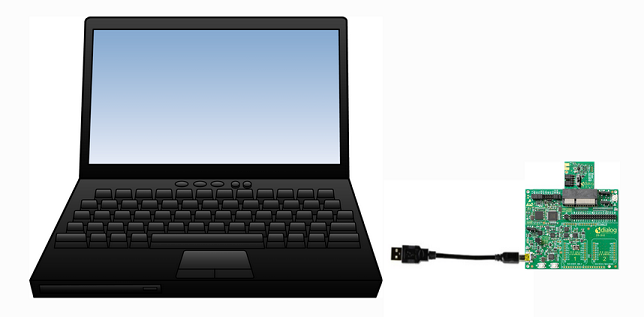

.. py_ble_manager documentation master file, created by
   sphinx-quickstart on Fri May 19 07:24:27 2023.
   You can adapt this file completely to your liking, but it should at least
   contain the root `toctree` directive.

Welcome to py_ble_manager's documentation!
==========================================

A python library for controlling Renesas BLE devices.

Purpose
------------

The intent of this library is to provide a python interface similar to `SDK10 <http://lpccs-docs.renesas.com/um-b-092-da1469x_software_platform_reference/User_guides/User_guides.html#the-ble-framework>`_
for controlling BLE of DA14xxx devices. This is achieved by communicating with a development kit running Generic Transport Layer (GTL) supported firmware over a USB port on your PC:

The primary intent is for use as a central device for benchtop testing, continuous integration, or as an end-of-line tool. For additional information on the GTL please see the
`GTL User Manual <https://www.renesas.com/us/en/document/mat/um-b-143-renesas-external-processor-interface-gtl-interface?language=en&r=1564826>`_

.. toctree::
   :maxdepth: 2
   :caption: Contents:

   quickstart
   basic_usage
   architecture
   modules

Indices and tables
==================

* :ref:`genindex`
* :ref:`modindex`
* :ref:`search`
