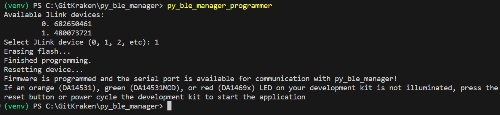

py_ble_manager Programmer
=========================

A utility for programming DA14xxx development kit flash with py_ble_manager compatible firmware.

If you have installed ``py_ble_manager``, you can call the executable in your *<Python install dir/Scripts>*: ``py_ble_manager_programmer``

.. note:: 
   If ``py_ble_manager_programmer`` is not found in your terminal, ensure *<Python install dir/Scripts>* is in your path.

Once running the script will:

#. identify J-Link devices connected to your PC
#. prompt you for which J-Link device to program
#. connect to your development kit over J-Link
#. erase the flash
#. program the appropriate py_ble_manager compatible binary
#. reset the device to start the firmware application

J-Link selection prompt:

.. image:: ../../src/py_ble_manager/util/assets/prompt.png

Progress with erasing/programming/resetting will be printed to the terminal:

Once the script is complete, your development kit is ready to communicate with the py_ble_manager library.

.. note::  
   Occasionally the script fails to reset the target to start the firmware. Simply press the reset button or remove and re-apply power to your development kit to reset the device.

If the LED on the development kit is illuminated, the application is running. Below shows the LED for various development kits:

* The DA14531 Pro Development kit:
    .. image:: ../../src/py_ble_manager/util/assets/da14531_pro_kit_jumpers_led_on.png

* The DA14531MOD Pro Development kit:
    .. image:: ../../src/py_ble_manager/util/assets/da14531mod_pro_kit_jumpers_led_on.png

* DA1469x Pro Development kit:
    .. image:: ../../src/py_ble_manager/util/assets/da1469x_pro_kit_jumpers_led_on.png

In the case of the DA1469x, you will be prompted which baud rate to use:

.. image:: ../../src/py_ble_manager/util/assets/terminal_baud.png

Note the default ``baud_rate`` used by a ``BleCentral`` object is 1M. If you select the 3M baud option, ensure you pass in the ``baud_rate`` parameter when creating a ``BleCentral`` object:

.. code-block:: python

    import py_ble_manager as ble

    central = ble.BleCentral("COM54", baud_rate=3000000)
