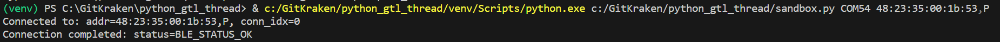
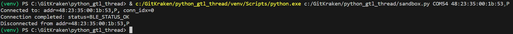

# central_simple_connect

This example demonstrates creating/initializing a BleCentral object, connecting to and disconnecting from a peripheral.

You can run it with:

`python central_simple_connect.py <com_port> <peripheral_addr>`

where `<com_port>` is the COM port associated with your development kit. Note, in the case of the Pro development kit there will be two COM ports associated with your development kit. You should use the lower of the two.

And `<peripheral_addr>` is the address of the peripheral you want to connect to. \
The address should be of the form 48:23:35:00:1b:53,P: \
&emsp; where 48:23:35:00:1b:53 is the BLE device address and last letter indicates the address type: \
&emsp;&emsp; P indicates a public address \
&emsp;&emsp; R indicates a random address

Once running, you should see messages indicating you have connected to your peripheral:

After about 3 seconds, you should see a message indicating you have disconnected from your peripheral and the application will exit:

