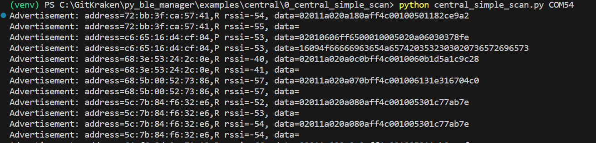

# central_simple_scan

This example demonstrates creating/initializing a BleCentral object, starting a scan, and printing advertisement data to the console.

You can run it with:

`python central_simple_scan.py <com_port>`

where `<com_port>` is the COM port associated with your development kit. Note, in the case of the Pro development kit there will be two COM ports associated with your development kit. You should use the lower of the two.

Once running, you should see advertisement data from any near by BLE devices print to the terminal:

After about 10 seconds, the scan will complete and the application will exit

