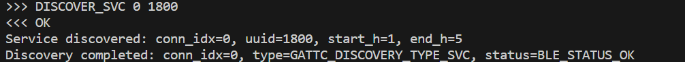
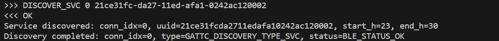
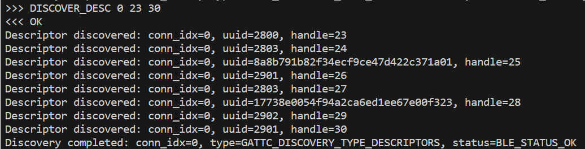

# central_cli

This example provides a command line interface to control a BLE central deivce. It supports scanning, connecting, reading, writing, etc.

You can run it with:

`python central_cli.py <com_port>`

where `<com_port>` is the COM port associated with your development kit. Note, in the case of the Pro development kit there will be two COM ports associated with your development kit. You should use the lower of the two.

Once running, you will be provided with a prompt:

Here you can enter various commands. The prompt will provide auto-complete for commands available:

For example, to scan for peripheral devices the `SCAN` command can be used. When a command is entered, a response will be immediately returned indicating if the command was processed correctly:

Once the command is processed, data from the BLE interaction will be returned. In the case of the `SCAN` command, advertising packets recevied from any peripheral devices are printed to the terminal:

## Command Usage

### SCAN

Scan for peripheral devices.

`SCAN`

Advertisement data will print to the terminal. Once the scan is finished, a message indicating the scan is complete will be printed to the terminal:

### SCAN_CANCEL

Cancel a scan for peripheral devices.

`SCAN_CANCEL`

Once the scan is canceled, a message indicating the scan is canceled will be printed to the terminal:

### CONNECT

Connect to a peripheral.

`CONNECT <address>`

For example:

`CONNECT 48:23:35:00:1b:53,P`

When the procedure is complete, a message indicationg so will be printed to the terminal:

### CONNECT_CANCEL

Cancel connecting to a peripheral.

`CONNECT_CANCEL`

For example:

`CONNECT_CANCEL`

When the procedure is complete, a message indicationg so will be printed to the terminal:

### DISCONNECT

Disconnect from a peripheral.

`DISCONNECT <connection_index>`

For example, to disconnect from the peripheral at connection index 0:

`DISCONNECT 0`

When the procedure is complete, a message indicationg you have disconnected will be printed to the terminal:

You may also pass a reason for diconnectiong. The reason should correspond to a `BLE_HCI_ERROR`:

`DISCONNECT <connection_index> <reason>`

For example, to disconnect from a peripheral at connection index 0 with the reason `BLE_HCI_ERROR_REMOTE_USER_TERM_CON`:

`DISCONNECT 0 19`

### BROWSE

Browse a peripheral's attributes.

`BROWSE <connection_index>`

For example, to browse the attributes of the peripheral at connection index 0:

`BROWSE 0`

When the procedure is complete, a message indicationg so will be printed to the terminal:

### DISCOVER_SVC

Discover a peripheral's services.

`DISCOVER_SVC <connection_index>`

For example:

`DISCOVER_SVC 0`

When the procedure is complete, a message indicationg so will be printed to the terminal:

You may also pass a specific service UUID to discover. 

For example, to discover a 16-bit service at connection index 0:

`DISCOVER_SVC 0 1800`

To discover a 128-bit service at connection index 0:

`DISCOVER_SVC 0 21ce31fcda2711edafa10242ac120002`

You may also enter the UUID with hyphens for readability:

`DISCOVER_SVC 0 21ce31fc-da27-11ed-afa1-0242ac120002`

### DISCOVER_CHAR

Discover a peripheral's characteristics.

`DISCOVER_CHAR <connection_index> <start_handle> <end_handle>`

For example, to discover characteristics between start handle 23 and end handle 30:

`DISCOVER_CHAR 0 23 30`

When the procedure is complete, a message indicationg so will be printed to the terminal:

You may also pass a specific characteristic UUID to discover:

`DISCOVER_CHAR <connection_index> <start_handle> <end_handle> <uuid>`

### DISCOVER_DESC

Discover a peripheral's descriptors.

`DISCOVER_DESC <connection_index> <start_handle> <end_handle>`

For example, to discover descriptors between start handle 23 and end handle 30:

`DISCOVER_DESC 0 23 30`

When the procedure is complete, a message indicationg so will be printed to the terminal:

### READ

Read a characteristic value.

`READ <connection_index> <handle>`

For example, to read handle 13 from the peripheral at connection index 0:

`READ 0 13`

When the procedure is complete, a message indicationg so will be printed to the terminal:

Note the data returned is little endian.

Note the Characteristic handle returned by the `BROWSE` command is that of the characteristic declaration. To read the value of the characteristic, add 1 to the handle returned by the `BROWSE` command. For example, if the `BROWSE` command identifies a characteristic handle as 12:

You would use handle 13 to read the characteristic value.

### WRITE

Write a characteristic value.

`WRITE <connection_index> <handle> <data>`

For example, to write 0x3412 to handle 13 of the peripheral at connection index 0:

`WRITE 0 13 1234`

Note the data should be written little endian. When the procedure is complete, a message indicationg so will be printed to the terminal:

Again note the Characteristic handle returned by the `BROWSE` command is that of the characteristic declaration. To write the value of the characteristic, add 1 to the handle returned by the `BROWSE` command. For example, if the `BROWSE` command identifies a characteristic handle as 12:

You would use handle 13 to write the characteristic value.

### WRITE_NO_RESP

Write a characteristic value with no response. 

`WRITE_NO_RESP <connection_index> <handle> <signed> <data>`

For example, to perform a signed write or 0x3412 to handle 13 of the peripheral at connection index 0:

`WRITE_NO_RESP 0 13 1 1234`

### SET_CONN_PARAM

Set the connection parameters.

`SET_CONN_PARAM <connection_index> <interval_min> <interval_max> <slave_latency> <sup_timeout>`

For example:

`SET_CONN_PARAM 0 50 70 0 420`

When the procedure is complete, a message indicationg so will be printed to the terminal:

### PAIR

Pair with a peripheral.

`PAIR <connection_index> <bond>`

For example, to pair to the peripheral at connection index 0:

`PAIR 0 0`

When the procedure is complete, a message indicationg so will be printed to the terminal:

### PASSKEY_ENTRY

Enter the passkey for Passkey Display pairing.

`PASSKEY_ENTRY <connection_index> <accept> <passkey>`

For example, to accept pairing at connection index 0 with passkey 945553:

`PASSKEY_ENTRY 0 1 945553`

Note the passkey to enter is presented on the display of the Peripheral.

When the procedure is complete, a message indicationg so will be printed to the terminal:

### YES_NO_ENTRY

Confirm pairing for Numeric Comparison pairing.

`YES_NO_ENTRY <connection_index> <accept>`

For example, to accept a secure connection at connection index 0:

`YES_NO_ENTRY 0 1`

When the procedure is complete, a message indicationg so will be printed to the terminal:

