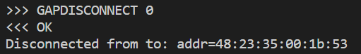
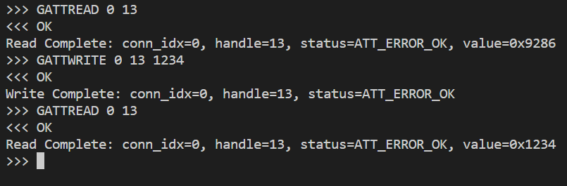

# central_at_command_cli

This example provides a AT Command like interface to control a BLE central deivce. It supports scanning, connecting, reading, writing, etc.

You can run it with:

`python central_at_command_cli.py <COM_PORT>`

where `<COM_PORT>` is the COM port associated with your development kit. Note, in the case of the Pro development kit there will be two COM ports associated with your development kit. You should use the lower of the two.

Once running, you will be provided with a prompt:

Here you can enter various commands. The prompt will provide auto-complete for commands available:

For example, to scan for peripheral devices the `GAPSCAN` command can be used. When a command is entered, a response will be immediately returned indicating if the command was processed correctly:

Once the command is processed, data from the BLE interaction will be returned. In the case of the `GAPSCAN` command, advertising packets recevied from any peripheral devices are printed to the terminal:

## Command Usage

### GAPSCAN

Scan for peripheral devices.

`GAPSCAN`

Advertisement data will print to the terminal. Once the scan is finished, a message indicating the scan is complete will be printed to the terminal:

### GAPCONNECT

Connect to a peripheral.

`GAPCONNECT <address>`

For example:

`GAPCONNECT 48:23:35:00:1b:53`

When the procedure is complete, a message indicationg so will be printed to the terminal:

### GAPBROWSE

Browse a peripheral's attributes.

`GAPBROWSE <connection_index>`

For example, to browse the attributes of the peripheral at connection index 0:

`GAPBROWSE 0`

When the procedure is complete, a message indicationg so will be printed to the terminal:

### GAPDISCONNECT

`GAPDISCONNECT <connection_index>`

For example, to disconnect from the peripheral at connection index 0:

`GAPDISCONNECT 0`

When the procedure is complete, a message indicationg you have disconnected will be printed to the terminal:

You may also pass a reason for diconnectiong. The reason should correspond to a `BLE_HCI_ERROR`:

`GAPDISCONNECT <connection_index> <reason>`

For example, to disconnect from a peripheral at connection index 0 with the reason `BLE_HCI_ERROR_REMOTE_USER_TERM_CON`:

`GAPDISCONNECT 0 19`

### GAPPAIR

`GAPPAIR <connection_index> <bond>`

For example, to bond to the peripheral at connection index 0:

`GAPPAIR 0 1`

When the procedure is complete, a message indicationg so will be printed to the terminal:

### GATTREAD

`GATTREAD <connection_index> <handle>`

For example, to read hanlde 13 from the peripheral at connection index 0:

`GATTREAD 0 13`

When the procedure is complete, a message indicationg so will be printed to the terminal:

### GATTWRITE

`GATTWRITE <connection_index> <handle> <data>`

For example, to write 0x1234 to hanlde 13 of the peripheral at connection index 0:

`GATTWRITE 0 13 1234`

When the procedure is complete, a message indicationg so will be printed to the terminal:

### GATTWRITENORESP

`GATTWRITENORESP <connection_index> <handle> <signed> <data>`

For example, to perform a signed write or 0x1234 to hanlde 13 of the peripheral at connection index 0:

`GATTWRITENORESP 0 13 1 1234`

### GAPSETCONNPARAM

`GAPSETCONNPARAM <connection_index> <interval_min> <interval_max> <slave_latency> <sup_timeout>`

For example:

`GAPSETCONNPARAM 0 50 70 0 420`

### PASSKEYENTRY

`PASSKEYENTRY <connection_index> <accept> <passkey>`

For example, to accept a ...(TODO)... at connection index 0 with passkey 1234:

`PASSKEYENTRY 0 1 1234`

### YESNOTENTRY

`YESNOTENTRY <connection_index> <accept>`

For example, to accept a ...(TODO)... at connection index 0:

`YESNOTENTRY 0 1`