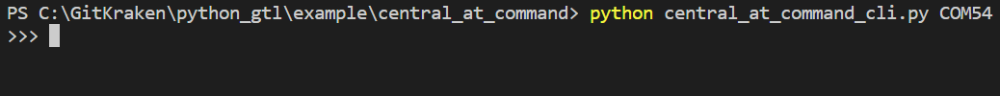

# central_crash_info

This example provides a command line interface to retreive crash information from a DA14531 peripheral running the Debug Crash Info Service. See the 
[Debug Crash Info Github](https://github.com/Renesas-US-Connectivity/dlg_crash_info) for additional details. 

You can run it with:

`python central_crash_info.py <COM_PORT>`

where `<COM_PORT>` is the COM port associated with your development kit. Note, in the case of the Pro development kit there will be two COM ports associated with your development kit. You should use the lower of the two.

Once running, you will be provided with a prompt:

Here you can enter various commands. The prompt will provide auto-complete for commands available:

For example, to scan for peripheral devices the `GAPSCAN` command can be used. When a command is entered, a response will be immediately returned indicating if the command was processed correctly:

Once the command is processed, data from the BLE interaction will be returned. In the case of the `GAPSCAN` command, The name, Bluetooth device address, and number of resets from any peripheral devices advertising the AD Type `Service Data - 128-bit UUID` for the Debug Crash Info service, will be printed to the terminal:

Note all data printed to the terminal that is not preceded with `>>>` or `<<<` will be saved to a log in `<path_to_script>/logs`. Log names include the date/time the script was run, for example: `DCI_log_20230502-175133.txt`

## Command Usage

### GAPSCAN

Scan for peripheral devices.

`GAPSCAN`

The name, Bluetooth device address, and number of resets for any device advertising the AD Type `Service Data - 128-bit UUID` for the Debug Crash Info service will be printed to the terminal

### GETALLRESETDATA

Fetch all reset data available from the specified peripheral:

`GETALLRESETDATA <address>`

For example:

`GETALLRESETDATA 48:23:35:00:1b:53,P`

When the procedure is complete, the reset data will be printed to the terminal and the application will exit:

### EXIT

Exit the application. For example:

`EXIT`