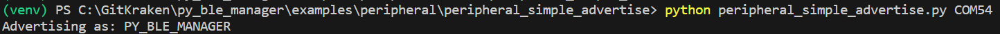
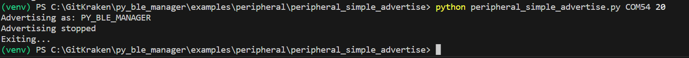

# peripheral_simple_advertise

This example demonstrates creating/initializing a BlePeripheral object, setting the device name and advertising data, and initiating advertising

You can run it with:

`python peripheral_simple_advertise.py <com_port>`

where `<com_port>` is the COM port associated with your development kit. Note, in the case of the Pro development kit there will be two COM ports associated with your development kit. You should use the lower of the two.

Once running, you should see the device name used for advertising printed to the terminal:

After 20 seconds, advertising will be stopped and the application will exit

