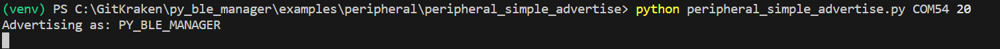
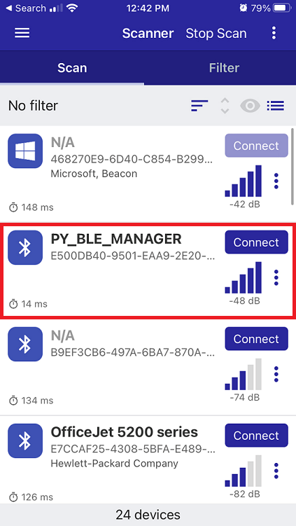

# peripheral_simple_advertise

This example demonstrates creating/initializing a BlePeripheral object, setting the device name and advertising data, and initiating advertising.

You can run it with:

`python peripheral_simple_advertise.py <com_port> <timeout_s>`

`<com_port>` is the COM port associated with your development kit. Note, in the case of the Pro development kit there will be two COM ports associated with your development kit. You should use the lower of the two.

`<timeout_s>` is the time (in seconds) to wait before advertising stops and the application exits.

Once running, you should see the device name used for advertising printed to the terminal:

You can verify the device is advertising with the Renesas Smart Bond app available for [iOS](https://apps.apple.com/us/app/renesas-smartbond/id1623197578) or [Android](https://play.google.com/store/apps/details?id=com.renesas.smartbond&hl=en_US&gl=US):

After 20 seconds, advertising will be stopped and the application will exit:

