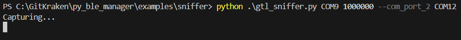
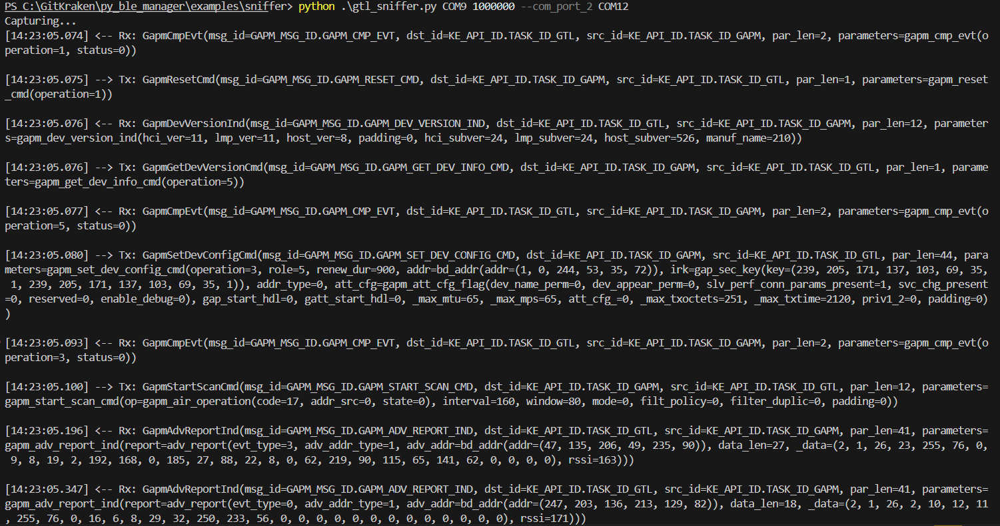
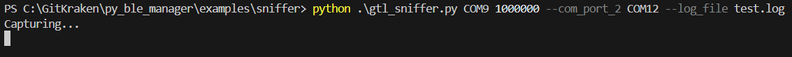

# gtl_sniffer.py

This is a utility script for sniffing serial GTL communication between a host and DA14xxx BLE device. You can sniff communication from the host to the BLE device,
from the BLE device to the host, or both.

**WARNING** this scipt and the classes it leverages use the threading library to read from two serialports simultaneously. There may be minor errors
in timestamping/order of messages due to this. For most percise sniffing, reference the [asyncio version](../asyncio/) of this script.

It requires at least one USB-to-UART converter, two if you are sniffing Tx and Rx simultaneously. The Rx pin of your USB-to-UART converter(s) should be connected
to the Host-BLE pin you are intereseted in sniffing:

Host   --  Tx -- > BLE: Connect USB-to-UART Rx pin to the Host Tx pin to sniff GTL messages destined for the BLE device. \
Host < -- Rx  --   BLE: Connect USB-to-UART Rx pin to the Host Rx pin to sniff GTL messages destined for the Host.

You can run it with:

`python gtl_sniffer_aio.py <com_port_1> <baud_rate> <--com_port_2> <--log_file>`

`<com_port_1>` is the COM port associated with your (first) USB-to-UART converter.

`<baud_rate>` is the baud rate of serial communication.

`<--com_port_2>` is the COM port associated with your second USB-to-UART converter if you are sniffing both Tx and Rx.

`<--log_file>` is the path to a file to save GTL communication to. If no log file is provided, information will be logged to the terminal.

## Running *without* a log file

Once running, a message will print to the terminal to indicate sniffing has started:

You should see messages printed to the terminal once GTL communication is started:

## Running *with* a log file

Once running, a message will print to the terminal to indicate sniffing has started:

You should see the messages in your log file once GTL communication is started:

