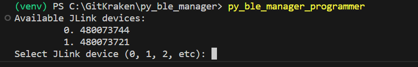
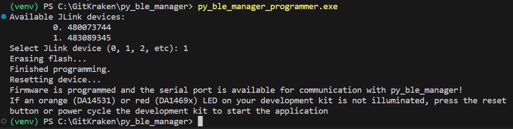

# py_ble_manager_programmer

A utility for programming DA14xxx development kit flash with py_ble_manager compatible firmware.

If you have installed py_ble_manager, you can call the executable in your *<Python install dir/Scripts>*:

`py_ble_manager_programmer`

> **_NOTE:_** If py_ble_manager_programmer is not found in your terminal, ensure *<Python install dir/Scripts>* is in your path.

To run the python script directly call:

`python py_ble_manager_programmer.py`

Once running the script will:

1. identify J-Link devices connected to your PC
2. prompt you for which J-Link device to program
3. connect to your development kit over J-Link
4. erase the flash
5. program the appropriate py_ble_manager compatible binary
6. reset the device to start the firmware application

J-Link selection prompt:

Progress with erasing/programming/resetting will be printed to the terminal:

Once the script is complete, your development kit is ready to communicate with the py_ble_manager library.

> **_NOTE:_** Occasionally the script fails to reset the target to start the firmware. Simply remove and re-apply power to your development kit to reset the device.
