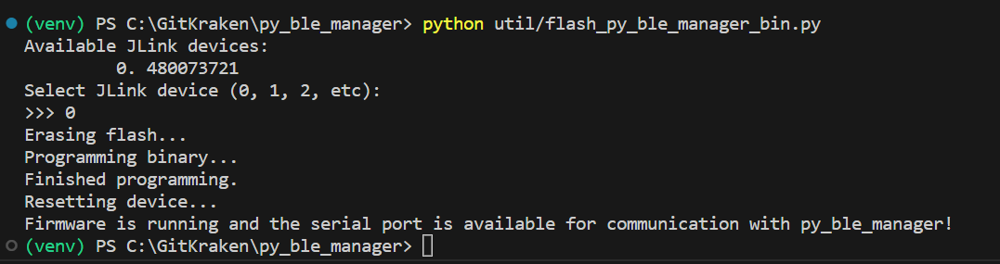
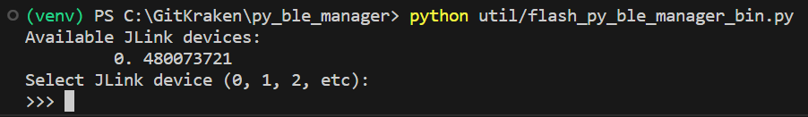

# flash_py_ble_manager_bin

A utility for programming DA14xxx development kit flash with py_ble_manager compatible firmware.

You can run it with:

`python flash_py_ble_manager_bin.py <path/to/binary.bin> <MCU>`

where `<binary.bin>` is one of the py_ble_manager compatible binaries located in [firmware](./../firmware/)
and `<MCU>` is the microcontroller on your development kit (e.g. DA14531, DA14695, etc.)

Once running the script will:

1. connect to your development kit over J-Link
2. erase the flash
3. programm the binary
4. reset the device to start the firmware application

Progress with the above sequence will be printed to the terminal:

Note, if you have multiple J-Link devices connected to your PC, a prompt will be displayed to choose the appropriate device.

Once the script is complete your development kit is ready to communicate with the py_ble_manager library.
